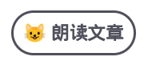

# Neko Speech

使用Neko Speech为您的网站添加朗读内容功能：

```html
<div id="nekospeech"></div>
<script src="https://speech.cdn.nekonode.com/nekospeech.js"></script>
```

项目面向个人博客等用途免费，发送邮件至speech@nekonode.com以开通服务。



您可以访问下面的网页查看效果：

- [WebAssembly介绍与Rust后端集成](https://www.lirui.tech/post/2022/bf75512a88f1.html)